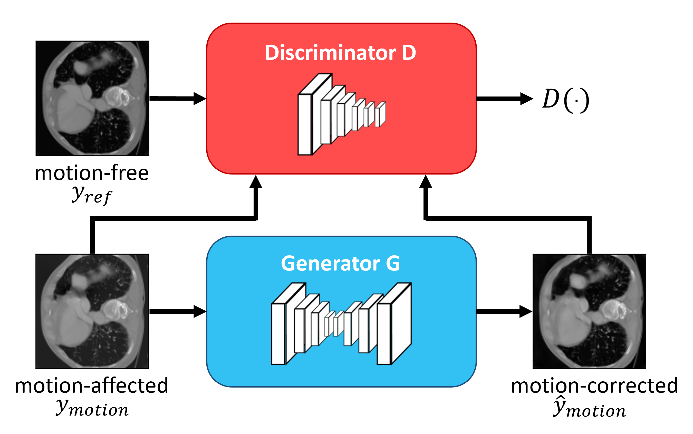
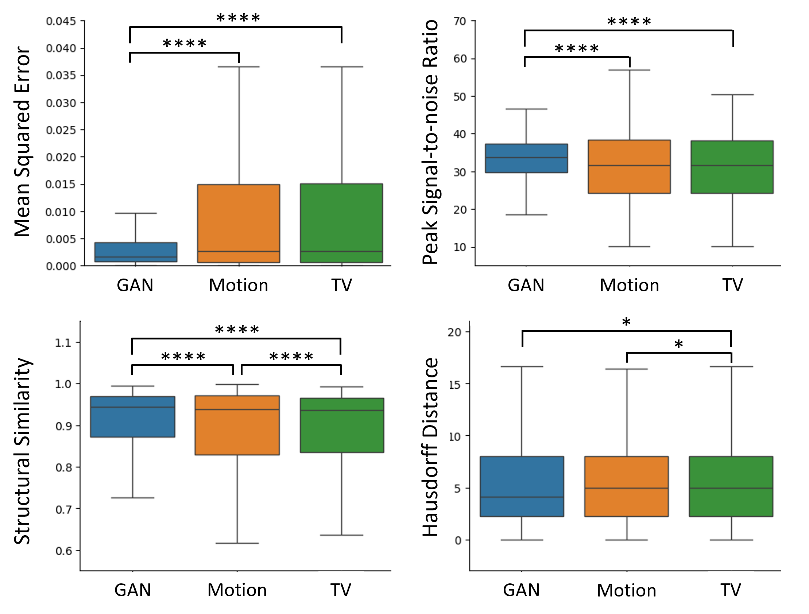
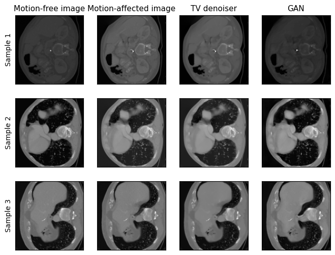

# Image-synthesis-for-motion-artifacts-mitigation-in-interventional-CT
This is the final project of JHU EN.580.627 Deep Learning for Medical Imaging course.
## Methods
* Dataset: TCIA Lymph Node Abdomen dataset, including 88 multidetector CT.
* Model: Conditional GAN with a modified UNet generator and a CNN discriminator. Below is the overall framework:
  
* Loss function: Pixel loss + perceptual loss + adversarial loss.
* Evaluation: Mean Squared Error (MSE), Peak Signal-to-Noise Ratio (PSNR), Structural Similarity Index (SSIM), and Hausdorff Distance (HD). Compared with conventional total variation (TV) denoising.
## Results
Image quality scores of motion-affected, TV-denoised, and GAN-generated images. Motion-free images are used as reference. The best qualities are bolded:
| Metrics           | MSE                      | PSNR                      | SSIM                    | HD                        |
|-------------------|--------------------------|---------------------------|-------------------------|---------------------------|
| Motion-affected   | 19.9639 × 10⁻³ ± 0.0440  | 31.4970 ± 7.9058           | 0.8520 ± 0.1963         | 5.8740 ± 5.7612           |
| TV-denoised       | 19.9267 × 10⁻³ ± 0.0439  | 31.2140 ± 9.2304           | 0.8498 ± 0.1945         | 6.0619 ± 5.7854           |
| GAN               | **4.8628 × 10⁻³ ± 0.0135** | **33.2646 ± 5.5166**        | **0.9011 ± 0.1189**      | **5.8509 ± 5.3868**       |

Group difference between the image quality of GAN-generated, TV-denoised, and motion-affected images:

Sample visualization:

